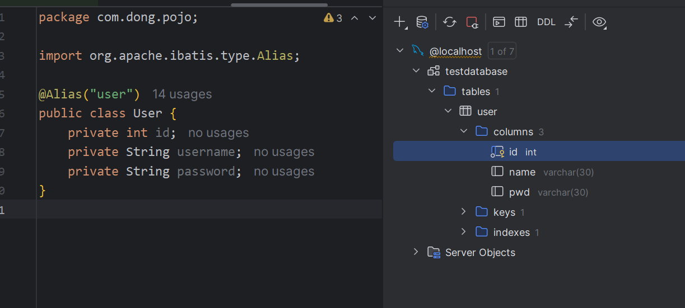
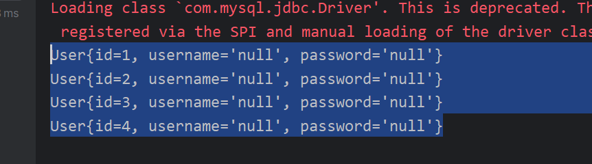
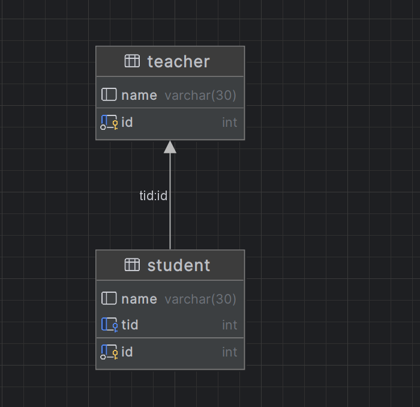
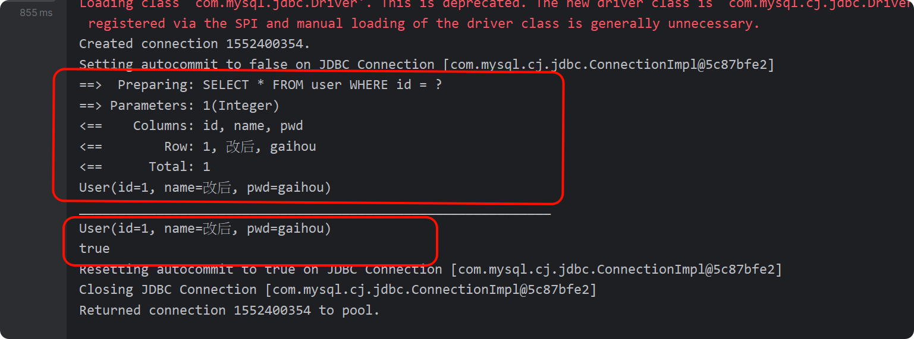
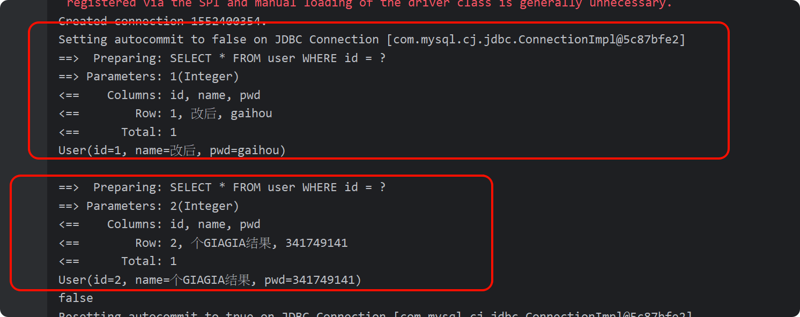
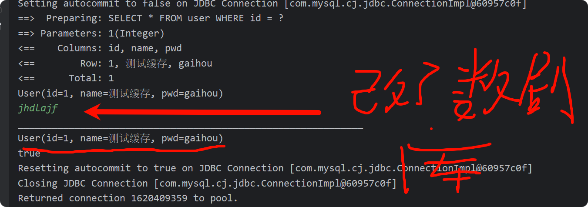
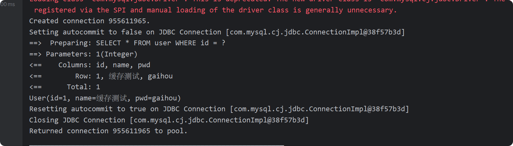
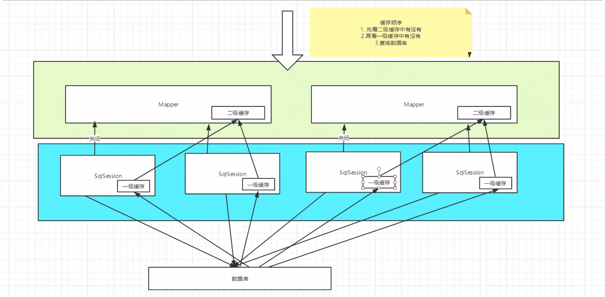

# Mybatis


## 配置

### 配置模版

mapper.xml

```xml
<?xml version="1.0" encoding="UTF-8" ?>
<!DOCTYPE mapper
        PUBLIC "-//mybatis.org//DTD Mapper 3.0//EN"
        "https://mybatis.org/dtd/mybatis-3-mapper.dtd">


<mapper namespace="com.dong.dao.UserMapper">


</mapper>

```

MybatisConfig.xml

```xml
<?xml version="1.0" encoding="UTF-8" ?>
<!DOCTYPE configuration
        PUBLIC "-//mybatis.org//DTD Config 3.0//EN"
        "https://mybatis.org/dtd/mybatis-3-config.dtd">

<configuration>
    <properties resource="db.properties"/>

    <settings>
        <!--标准日志 -->
        <setting name="logImpl" value="STDOUT_LOGGING"/>
    </settings>

    <!-- 给类起别名   -->
    <typeAliases>
        <!-- 通过扫描包时起别名 -->
        <package name="com.dong.pojo"/>
    </typeAliases>

    <environments default="development">
        <environment id="development">
            <transactionManager type="JDBC"/>
            <dataSource type="POOLED">
                <property name="driver" value="${driver}"/>
                <property name="url" value="${url}"/>
                <property name="username" value="${username}"/>
                <property name="password" value="${password}"/>
            </dataSource>
        </environment>
    </environments>

    <!--注册Mapper-->
    <mappers>
        <package name="com.dong.dao"/>
    </mappers>

</configuration>
```

dp.properties

```properties
driver=com.mysql.jdbc.Driver
url=jdbc:mysql://localhost:3306/testdatabase?useUnicode=true&characterEncoding=utf-8 
username=root
password=123456
```


配置文件( [mybatis-config.xml](..\..\java\JavaWeb\StudyMybatis\Mybatis01\src\main\resources\mybatis-config.xml) )

```xml
<?xml version="1.0" encoding="UTF-8" ?>
<!DOCTYPE configuration
        PUBLIC "-//mybatis.org//DTD Config 3.0//EN"
        "https://mybatis.org/dtd/mybatis-3-config.dtd">

<!--核心配置文件-->
<configuration>
    <environments default="development">
        <environment id="development">
            <transactionManager type="JDBC"/>
            <dataSource type="POOLED">
                <!--JDBC驱动-->
                <property name="driver" value="com.mysql.jdbc.Driver"/>
                <!--url-->
                <property name="url" value="jdbc:mysql://localhost:3306/testdatabase?useUnicode=true&amp;characterEncoding=utf-8"/>
                <!--账号-->
                <property name="username" value="root"/>
                <!--密码-->
                <property name="password" value="123456"/>
            </dataSource>
        </environment>
    </environments>


    <!--每一个Mapper接口都对应一个xml-->
    <mappers>
        <mapper resource="com/dong/dao/UserMapper.xml"/>
    </mappers>
</configuration>
```

---


## CRUD

### 准备

**pojo**

```java
package com.dong.pojo;

public class User {

    //Mybatis中属性要和数据库同名(区分大小写)
    private int id;
    private String name;
    private String pwd;

    @Override
    public String toString() {
        return "User{" +
                "id=" + id +
                ", name='" + name + '\'' +
                ", pwd='" + pwd + '\'' +
                '}';
    }

    public int getId() {
        return id;
    }

    public void setId(int id) {
        this.id = id;
    }

    public String getName() {
        return name;
    }

    public void setName(String name) {
        this.name = name;
    }

    public String getPwd() {
        return pwd;
    }

    public void setPwd(String pwd) {
        this.pwd = pwd;
    }

    public User(int id, String name, String pwd) {
        this.id = id;
        this.name = name;
        this.pwd = pwd;
    }

    public User() {
    }
}

```


**dao接口**

```java
public interface UserMapper {
    List<User> getUserList();
    User getUserById(int id);
    int addUser(User user);
    int updateUser(User user);
    int deleteUser(int id);
    List<User> getUserListLike(String value);
}
```


**utils**

```java
public class MybatisUtil {
    private static SqlSessionFactory sqlSessionFactory;

    static {
        try {
            //获取sqlSessionFactory对象
            String resource = "mybatis-config.xml";
            InputStream inputStream = Resources.getResourceAsStream(resource);
            sqlSessionFactory = new SqlSessionFactoryBuilder().build(inputStream);
        } catch (IOException e) {
            throw new RuntimeException(e);
        }
    }


    //获取SqlSession实例
    public static SqlSession getSqlSession() {
        return sqlSessionFactory.openSession();
    }


}
```


mapper.Xml

```xml
<?xml version="1.0" encoding="UTF-8" ?>
<!DOCTYPE mapper
        PUBLIC "-//mybatis.org//DTD Mapper 3.0//EN"
        "https://mybatis.org/dtd/mybatis-3-mapper.dtd">

<!--namespace 绑定一个对应的Dao.Mapper接口-->
<mapper namespace="com.dong.dao.UserMapper">
    
</mapper>


```


### select

```xml
    <!-- select查询语句(不带参数)  resultType返回结果 -->
    <select id="getUserList" resultType="com.dong.pojo.User">
        select * from testdatabase.user
    </select>

    <!-- select查询语句(带参数parameterType) -->
    <select id="getUserById" parameterType="int" resultType="com.dong.pojo.User">
        select * from testdatabase.user where id = #{id}
    </select>

    <!-- 模糊查询 like  -->
    <select id="getUserListLike" resultType="com.dong.pojo.User">
    select * from testdatabase.user where name like #{value}
    <!-- select * from testdatabase.user where name like "%" #{value} "%" 在sql中拼接匹配符 -->
    </select>
```

```java
    @Test
    public void test() {
        // 获取sqlSession对象
        SqlSession sqlSession = MybatisUtil.getSqlSession();
        UserMapper mapper = sqlSession.getMapper(UserMapper.class);
        List<User> userList = mapper.getUserList();
        for (User user : userList) {
            System.out.println(user.toString());
        }
        sqlSession.close();
    }

    @Test
    public void getUserById(){
        SqlSession sqlSession = MybatisUtil.getSqlSession();
        UserMapper mapper = sqlSession.getMapper(UserMapper.class);
        User user = mapper.getUserById(1);
        System.out.println(user.toString());
        sqlSession.close();
    }

    //模糊查询
    @Test
    public void getUserListLike(){
        SqlSession sqlSession = MybatisUtil.getSqlSession();
        UserMapper mapper = sqlSession.getMapper(UserMapper.class);
        //通过% %号
        List<User> userListLike = mapper.getUserListLike("%小%");
        if(userListLike == null && userListLike.isEmpty()){
            System.out.println("没查到信息");
        } else {
            for (User user : userListLike) {
                System.out.println(user.toString());
            }
        }
        sqlSession.close();
    }
```


### insert

```xml
<!-- 插入语句   -->
<insert id="addUser" parameterType="com.dong.pojo.User">
    insert into testdatabase.user (id,name,pwd) values (#{id},#{name},#{pwd})
</insert>
```

```java
// 增删改需要提交事物
    @Test
    public void addUser(){
        SqlSession sqlSession = MybatisUtil.getSqlSession();
        UserMapper mapper = sqlSession.getMapper(UserMapper.class);
        int res = mapper.addUser(new User(4, "小晓", "13414414"));
        if(res > 0){
            System.out.println("增加成功");
        } else {
            System.out.println("增加失败");
        }
        sqlSession.commit();
        sqlSession.close();
    }
```

### uptate

```xml
<!--更新语句    -->
<update id="updateUser" parameterType="com.dong.pojo.User">
    update testdatabase.user set name = #{name}, pwd = #{pwd} where id = #{id};
</update>
```

```java
@Test
    public void updateUser(){
        SqlSession sqlSession = MybatisUtil.getSqlSession();
        UserMapper mapper = sqlSession.getMapper(UserMapper.class);
        int res = mapper.updateUser(new User(1, "改后", "gaihou"));
        if(res > 0){
            System.out.println("更新成功");
        } else {
            System.out.println("更新失败");
        }
        sqlSession.commit();
        sqlSession.close();
    }
```


### delete

```xml
<!--删除语句    -->
    <delete id="deleteUser" parameterType="int">
        delete from testdatabase.user where id = #{id};
    </delete>
```

```java
@Test
    public void deleteUser(){
        SqlSession sqlSession = MybatisUtil.getSqlSession();
        UserMapper mapper = sqlSession.getMapper(UserMapper.class);
        int res = mapper.deleteUser(4);
        if(res > 0){
            System.out.println("删除成功");
        } else {
            System.out.println("删除失败");
        }
        sqlSession.commit();
        sqlSession.close();
    }
```

---


## 配置优化

### 数据库配置

通过扫描properties文件来配置

```properties
url=jdbc:mysql://localhost:3306/testdatabase?useUnicode=true&characterEncoding=utf-8 
username=root
password=123456

# 通过配置文件的url不是xml配置文件 没有&amp;
```

```xml
<configuration>
    <!--通过外部配置文件来引入配置-->
    <properties resource="db.properties"/>

    <environments default="development">
        <environment id="development">
            <transactionManager type="JDBC"/>
            <dataSource type="POOLED">
                <property name="driver" value="${driver}"/>
                <property name="url" value="${url}"/>
                <property name="username" value="${username}"/>
                <property name="password" value="${password}"/>
            </dataSource>
        </environment>
    </environments>
</configuration>
```

### 给类起别名

在写Mapper配置文件时

```xml
<mapper namespace="com.dong.dao.UserMapper">
    <select id="getUserList" resultType="com.dong.pojo.User">
        select * from testdatabase.user
    </select>

</mapper>
```

com.dong.pojo.User很麻烦所以要给他起个别名

#### 扫描包

**这种配置文件放在Mybatis的配置中**

会自动的将实体类的类名小写为别名

```xml
<!-- 给类起别名   -->
<typeAliases>
    <!-- 通过扫描包时起别名 -->
    <package name="com.dong.pojo"/>
</typeAliases>
```

#### 写别名

```xml
<!-- 给类起别名   -->
<typeAliases>
    <!-- 自己写       -->
    <typeAlias type="com.dong.pojo.User" alias="user"/>
</typeAliases>
```

#### 注解

```java
@Alias("user")
public class User {
    //...
}
```

### 映射器

每一个Mapper配置文件都要在Mybatis的核心配置文件中注册

有多种注册方式

```xml
<!-- 使用相对于类路径的资源引用 -->
<mappers>
  <mapper resource="org/mybatis/builder/AuthorMapper.xml"/>
  <mapper resource="org/mybatis/builder/BlogMapper.xml"/>
  <mapper resource="org/mybatis/builder/PostMapper.xml"/>
</mappers>
<!-- 使用完全限定资源定位符（URL） -->
<mappers>
  <mapper url="file:///var/mappers/AuthorMapper.xml"/>
  <mapper url="file:///var/mappers/BlogMapper.xml"/>
  <mapper url="file:///var/mappers/PostMapper.xml"/>
</mappers>
<!-- 使用映射器接口实现类的完全限定类名 -->
<mappers>
  <mapper class="org.mybatis.builder.AuthorMapper"/>
  <mapper class="org.mybatis.builder.BlogMapper"/>
  <mapper class="org.mybatis.builder.PostMapper"/>
</mappers>
<!-- 将包内的映射器接口全部注册为映射器 -->
<mappers>
  <package name="org.mybatis.builder"/>
</mappers>
```

---


## 生命周期和作用域


**SqlSessionBuilder:**

- 一但创建了SqlSessionFactory,就不在需要了
- 可以定义为局部变量  
  

**SqlSessionFactory:**

  - 可以想象为一个数据库连接池
  - SqlSessionFactory一但被创建就应该在运行期间一直存在,**没有任何理由丢弃它或者创建另一个实例**
  - 可以用**单例模式**或者静态单例模式  

**SqlSession:**

- 连接到连接池的一个请求
- SqlSession的实例是不安全的,因此不能被共享,所以他的最佳作用域就是在请求或者方法中
- 用完之后及时关闭,否则资源被占用


---


## 数据库字段和属性名不一致



查询结果



**可以用ResultMap结果集映射,可以得到正常结果**

```xml
<mapper namespace="com.dong.dao.UserMapper">
    <!-- 通过映射   -->
    <resultMap id="UserMap" type="User">
        <result column="id" property="id"/>
        <result column="name" property="username"/>
        <result column="pwd" property="password"/>
    </resultMap>

    <select id="getUserList" resultMap="UserMap">
        select * from testdatabase.user
    </select>

</mapper>
```

---


## 日志

### 日志工厂

```xml
<!--设置 -->
    <settings>
        <!--标准日志 -->
        <setting name="logImpl" value="STDOUT_LOGGING"/>
    </settings>
```


### log4j

导包

```xml
<!-- https://mvnrepository.com/artifact/log4j/log4j -->
        <dependency>
            <groupId>log4j</groupId>
            <artifactId>log4j</artifactId>
            <version>1.2.17</version>
        </dependency>
```


通过配置文件进行配置

```properties
##########Set Log Levels###############
log4j.rootLogger = DEBUG, console, D, E

######### 输出到控制台 ####################
log4j.appender.console = org.apache.log4j.ConsoleAppender
log4j.appender.console.Target = System.out
log4j.appender.console.layout = org.apache.log4j.PatternLayout
log4j.appender.console.layout.ConversionPattern = %d{ABSOLUTE}%5p%c{ 1 :%L-%m%n
######### 输出到文件 ####################
log4j.appender.D = org.apache.log4j.DailyRollingFileAppender
log4j.appender.D.File = ./logs/log.log
log4j.appender.D.Append = true
log4j.appender.D.Threshold = DEBUG ##输出DEBUG级别以上的日志
log4j.appender.D.layout = org.apache.log4j.PatternLayout
log4j.appender.D.layout.ConversionPattern = %-d{yyyy-MM-dd HH:mm:ss} [%t:%r]-[%p] %m%n
```

---


## 数据库分页

### limit分页

```sql
select * from 表名 limit starIndex,pageSize;
```

- **map实现分页**

```java
List<User> selectByLimit1(Map<String,Integer> map);//野路子
```

```xml
    <!-- 野路子   -->
    <select id="selectByLimit1" parameterType="map" resultType="user">
        select * from testdatabase.user limit ${startIndex},${pageSize}
    </select>
```

```java
@Test
public void testLimit1() {
    //获取sqlSession
    SqlSession sqlSession = MybatisUtil.getSqlSession();
    //获取接口
    UserMapper userMapper = sqlSession.getMapper(UserMapper.class);

    HashMap<String,Integer> map = new HashMap<>();
    map.put("startIndex",0);
    map.put("pageSize",2);

    userMapper.selectByLimit1(map);

    sqlSession.close();
}
```

- **注解实现**

```java
List<User> selectByLimit2(@Param("startIndex") String startIndex, @Param("pageSize") String pageSize);// 使用注解
```

```xml
    <!--parameterType 只能指定一个参数类型-->
    <select id="selectByLimit2" parameterType="map" resultType="user">
        select * from testdatabase.user limit ${startIndex},${pageSize}
    </select>
```

```java
@Test
public void testLimit2() {
    //获取sqlSession
    SqlSession sqlSession = MybatisUtil.getSqlSession();
    //获取接口
    UserMapper userMapper = sqlSession.getMapper(UserMapper.class);

    userMapper.selectByLimit2("0","2");
    sqlSession.close();
}
```

### RowBounds分页

```java
List<User> selectByRowBounds();
```

```xml
<select id="selectByRowBounds" resultType="user">
        select * from testdatabase.user
    </select>
```

```java
@Test
    public void testSelectByRowBounds() {
        SqlSession sqlSession = MybatisUtil.getSqlSession();

        RowBounds rowBounds = new RowBounds(0, 2);

        sqlSession.selectList("com.dong.dao.UserMapper.selectByRowBounds",null,rowBounds);

        sqlSession.close();
    }
```

### 分页插件

PageHelper

---


## 注解CRUD

注册Mapper

```xml
<mappers>
        <mapper class="com.dong.dao.UserMapper"/>
    </mappers>
```

接口实现,不用写Mapper的配置文件了

```java
public interface UserMapper {
    // 查询所有用户
    @Select("SELECT * FROM testdatabase.user")
    List<User> getUserList();

    // 根据 ID 查询用户
    @Select("SELECT * FROM testdatabase.user WHERE id = #{id}")
    User getUserById(@Param("id") int id);

    // 添加用户
    @Insert("INSERT INTO testdatabase.user (id, name, pwd) VALUES (#{id}, #{name}, #{pwd})")
    int addUser(User user);

    // 根据 ID 删除用户
    @Delete("DELETE FROM testdatabase.user WHERE id = #{id}")
    int deleteUserById(@Param("id") int id);

    @Update("UPDATE testdatabase.user SET name = #{name}, pwd = #{pwd} WHERE id = #{id}")
    int updateUserById(@Param("id") int id, @Param("name") String name, @Param("pwd") String pwd);
}

```

测试用例

```java
public class UserMapperTest {
    @Test
    public void getUserListTest(){
        SqlSession sqlSession = MybatisUtil.getSqlSession();
        UserMapper mapper = sqlSession.getMapper(UserMapper.class);

        mapper.getUserList();
        sqlSession.close();
    }

    @Test
    public void getUserByIdTest(){
        SqlSession sqlSession = MybatisUtil.getSqlSession();
        UserMapper mapper = sqlSession.getMapper(UserMapper.class);
        mapper.getUserById(1);

        sqlSession.close();
    }

    @Test
    public void insertUserTest(){
        SqlSession sqlSession = MybatisUtil.getSqlSession();
        UserMapper mapper = sqlSession.getMapper(UserMapper.class);
        User user = new User(6,"下搜","1341414");

        int i = mapper.addUser(user);
        if(i > 0){
            System.out.println("插入成功");
        }

        sqlSession.commit();
        sqlSession.close();
    }

    @Test
    public void updateUserTest(){
        SqlSession sqlSession = MybatisUtil.getSqlSession();
        UserMapper mapper = sqlSession.getMapper(UserMapper.class);
        User user = new User(2,"改革我该嘎","1341414");

        int i = mapper.updateUserById(2,"个GIAGIA结果","341749141");
        if(i > 0){
            System.out.println("更新成功");
        }
        sqlSession.commit();
        sqlSession.close();
    }

    @Test
    public void deleteUserTest(){
        SqlSession sqlSession = MybatisUtil.getSqlSession();
        UserMapper mapper = sqlSession.getMapper(UserMapper.class);

        int i = mapper.deleteUserById(4);
        if(i > 0){
            System.out.println("删除成功");
        }

        sqlSession.commit();
        sqlSession.close();
    }
}

```

**关于@Param()注解**

- 基本类型的参数或者String类型,需要加上
- 引用类型不需要加
- 如果只有一个引用类型的话,可以忽略

---

## Lombok

自动生成有参 无参 geter seter的插件

导入jar包

```xml
<!-- https://mvnrepository.com/artifact/org.projectlombok/lombok -->
<dependency>
    <groupId>org.projectlombok</groupId>
    <artifactId>lombok</artifactId>
    <version>1.18.34</version>
    <scope>provided</scope>
</dependency>
```

POJO书写

```java
//使用Lombok自动生成geter seter 无参 有参
@AllArgsConstructor//有参
@Data
@NoArgsConstructor
public class User {
    private int id;
    private String name;
    private String pwd;
}
```

## 多对一

```sql
use testdatabase;

CREATE TABLE teacher (
     id INT NOT NULL PRIMARY KEY,
     name VARCHAR(30)
) DEFAULT CHARSET = utf8;

create table student(
    id int not null primary key,
    name VARCHAR(30),
    tid INT,
    FOREIGN KEY (tid) REFERENCES teacher(id)
) DEFAULT CHARSET = utf8;

INSERT INTO teacher (id, name) VALUES
(1, '张老师');

INSERT INTO student (id, name, tid) VALUES
(101, '学生A', 1),
(102, '学生B', 1),
(103, '学生C', 1),
(104, '学生D', 1);
```



**学生(多)对老师(一) 就是 多对一**

执行多表查询的sql

```sql
SELECT s.id sid, s.name sname, t.name tname
FROM student s, teacher t
WHERE s.tid = t.id;
```

### 1.按照查询嵌套处理

```xml
<!--由于Student的POJO类中不光带有基本id,name等属性还包含别的POJO-->
    <!--1.按照查询嵌套处理-->
    <select id="selectAllAndTeacher1" resultMap="StudentTeacher1">
        select * from testdatabase.student
    </select>

    <resultMap id="StudentTeacher1" type="Student">
        <result property="id" column="id"/>
        <result property="name" column="name"/>
        <!--复杂的属性需要单独处理  association:对象  集合collection-->
        <association property="teacher" column="tid" javaType="Teacher" select="getTeacher"/>
    </resultMap>

    <select id="getTeacher" resultType="Teacher">
        select * from testdatabase.teacher where id = #{id}
    </select>
```

### 2.按照结果嵌套处理

```xml
<!--2.按照结果嵌套处理-->
    <select id="selectAllAndTeacher2" resultMap="StudentTeacher2">
        SELECT s.id sid, s.name sname, t.name tname
        FROM student s, teacher t
        WHERE s.tid = t.id;
    </select>
    
    <resultMap id="StudentTeacher2" type="Student">
        <result property="id" column="sid"/>
        <result property="name" column="sname"/>
        <association property="teacher" javaType="Teacher">
            <result property="name" column="tname"/>
        </association>
    </resultMap>
```

---


## 一对多处理

一个老师拥有多个学生

```sql
select t.id tid, t.name tname, s.id sid, s.name sname
from teacher t, student s
where t.id = s.tid and tid = 1;
```

```java
Teacher getTeacher(int id);
```

```xml
<select id="getTeacher" resultMap="TeacherAndStudent">
        select t.id tid, t.name tname, s.id sid, s.name sname
        from teacher t, student s
        where t.id = s.tid and tid = #{id}
    </select>
    
    <resultMap id="TeacherAndStudent" type="Teacher">
        <result property="id" column="tid"/>
        <result property="name" column="tname"/>
        
        <collection property="students" ofType="Student">
            <result property="id" column="sid"/>
            <result property="name" column="sname"/>
        </collection>
    </resultMap>
```

## 总结(一多 对 多一):

数据类型

```java
@Data
public class Teacher {
    private int id;
    private String name;

    //一个老师有多个学生
    private List<Student> students;
}
```

```java
@Data
public class Student {
    private int id;
    private String name;
    private Teacher teacher;
}
```

### **一对多**

**通过对比**

```xml
<select id="selectAllAndTeacher2" resultMap="StudentTeacher2">
        SELECT s.id sid, s.name sname, t.name tname
        FROM student s, teacher t
        WHERE s.tid = t.id;
    </select>
    
    <resultMap id="StudentTeacher2" type="Student">
        <result property="id" column="sid"/>
        <result property="name" column="sname"/>
        <association property="teacher" javaType="Teacher">
            <result property="name" column="tname"/>
        </association>
    </resultMap>
```

> 查询语句不用说
>
> ``<select id="selectAllAndTeacher2" resultMap="StudentTeacher2">其中id为接口名 ,resultMap为自定义名数据类型映射名(因为这不是基本数据类型)``
>
> ``<resultMap id="StudentTeacher2" type="Student">``type查的是Student类
>
> ```java
> <resultMap id="StudentTeacher2" type="Student">
>     <result property="id" column="sid"/> //对应学生类的id
>     <result property="name" column="sname"/> //对应学生类的name
>     
>     //对应学生类Teacher
>     <association property="teacher" javaType="Teacher">
>         <result property="name" column="tname"/>
>     </association>
>     
>    //property="teacher"这个就是学生类的属性名 而他对应的类型就是Teacher类
>     //Teacher类包含id和name,应为这里没查tid所以不需要映射
>     //<result property="name" column="tname"/>查询语句的tname查的是Teacher类的name
> </resultMap>
> ```

### 多对一

```xml
<select id="getTeacher" resultMap="TeacherAndStudent">
        select t.id tid, t.name tname, s.id sid, s.name sname
        from teacher t, student s
        where t.id = s.tid and tid = #{id}
    </select>
    
    <resultMap id="TeacherAndStudent" type="Teacher">
        <result property="id" column="tid"/>
        <result property="name" column="tname"/>
        
        <collection property="students" ofType="Student">
            <result property="id" column="sid"/>
            <result property="name" column="sname"/>
        </collection>
    </resultMap>
```


> resultMap="TeacherAndStudent"自定义映射
>
> ```xml
> <resultMap id="TeacherAndStudent" type="Teacher">
>         <result property="id" column="tid"/>// Teacher类的id
>         <result property="name" column="tname"/> // Teacher类的name
>         
>     	// Teacher类的private List<Student> students;这个属性
>         <collection property="students" ofType="Student">
>             <result property="id" column="sid"/>
>             <result property="name" column="sname"/>
>         </collection>
>     </resultMap>
> ```

**property带表属性**

 **column代表sql语句**

## 动态sql

**根据不同的条件生成不同的sql语句**

一些条件查询

```
if
choose (when, otherwise)
trim (where, set)
foreach
```

### IF

map

```java
//map集合
    List<Bolg> selectBolgByIF1(Map map);
```

```xml
<!--IF(map)    -->
    <select id="selectBolgByIF1" parameterType="map" resultType="Bolg">
        select * from blog where 1 = 1
        <if test="title != null">
            and title = #{title}
        </if>
        <if test="author != null">
            and author = #{author}
        </if>
        <if test="id != null">
            and id = #{id}
        </if>
    </select>

    
```

多参数(不需要传null)

```xml
//方法重载
List<Bolg> selectBolgByIF2(@Param("title") String title, @Param("author") String author, @Param("id") String id);
```

```java
<!--IF(多种参数)    -->
    <select id="selectBolgByIF2" resultType="Bolg">
        select * from blog where 1 = 1
        <if test="title != null">
            and title = #{title}
        </if>
        <if test="author != null">
            and author = #{author}
        </if>
        <if test="id != null">
            and id = #{id}
        </if>
    </select>
```

### where和and拼接问题

```xml
<select id="selectBolgByIF1" parameterType="map" resultType="Bolg">
    select * from blog where 1 = 1 //在正常工作中不可能写 where 1+1
    <if test="title != null">
        and title = #{title}
    </if>
    <if test="author != null">
        and author = #{author}
    </if>
</select>
```

1+1去除之后就有问题了

```xml
<select id="selectBolgByIF1" parameterType="map" resultType="Bolg">
    select * from blog where
    <if test="title != null">
        title = #{title}
    </if>
    <if test="author != null">
        and author = #{author}
    </if>
</select>
```

> 当1+1去除之后若查询title没有问题 ``select * from blog where title = ?``
>
> 但只查author时就会出现``select * from blog where and author = ?``这种sql,这种肯定是报错的

**解决方法**(加一层where标签)

```xml
<select id="selectBolgByIF2" resultType="Bolg">
    select * from blog
    <where>
        <if test="title != null">
            title = #{title}
        </if>
        <if test="author != null">
            and author = #{author}
        </if>
        <if test="id != null">
            and id = #{id}
        </if>
    </where>
</select>
```

当只选择查author这个条件时,底层会自动去掉and变为`` select * from blog WHERE author = ?``

### choose

```
<!--choose-->
<select id="selectBolgByChoose" parameterType="map" resultType="Bolg">
    select * from blog
    <where>
        <choose>
            <when test="author != null">author = #{author}</when>
            <when test="title != null">title = #{title}</when>
            <otherwise>id = #{id}</otherwise>
        </choose>
    </where>
</select>
```

> 查询,就是Switch case,按顺序author,title,id,当有author条件时,就会执行`` select * from blog WHERE author = ?``其他都不会执行
>
> title同理,就算同时设置了三个条件也会执行一个,当没有条件时,就会执行otherwise的条件查id

### set

```xml
<update id="updateBolgSet" parameterType="map">
    update blog
    <set>
        <if test="author != null">author = #{author},</if>
        <if test="title != null">title = #{title}</if>
    </set>
    where id = #{id}
</update>
```

set标签会自动将多余的逗号删除``update blog SET author = ?, title = ? where id = ?``设置两个参数就是这样

### sql标签

就是代码复用

```xml
<sql id="selectAllSQL">
    select * from blog
    //可以有别的标签,<if><when>什么的
</sql>
<select id="selectAll" resultType="Bolg">
    <include refid="selectAllSQL"></include>
</select>
```

**通过sql标签引用sql代码,然后通过include引入sql标签的id**

### foreach

```xml
<!-- foreach-->
<select id="selectBYID" parameterType="list" resultType="Bolg">
    select * from blog where id in
    <foreach collection="list" item="id" open="(" close=")" separator=",">
        id = #{id}
    </foreach>
</select>
```

如这里传递一个Arrlist集合,添加1,2,则出来的sql就是`` select * from blog where id in ( id = ? , id = ? )``

- collection 集合名
- item 遍历出来的名字
- open 拼接的字符串开始
- close 拼接字符串的结束
- separator 遍历出来的东西用什么拼接

---

## 缓存

### 一级缓存

**一级缓存默认是开启的,只在一次sqlSession中有效**

```java
@Test
    public void getUserByIdTest() {
        SqlSession sqlSession = MybatisUtil.getSqlSession();
        UserMapper mapper = sqlSession.getMapper(UserMapper.class);

        User user1 = mapper.getUserById(1);
        System.out.println(user1);

        System.out.println("_____________________________________________________________");

        User user2 = mapper.getUserById(1);
        System.out.println(user2);

        System.out.println(user1 == user2);


        sqlSession.close();
    }
```




**可以看到值查询了一次,第二次其实是从缓存中拿的**


```java
@Test
    public void getUserByIdTest() {
        SqlSession sqlSession = MybatisUtil.getSqlSession();
        UserMapper mapper = sqlSession.getMapper(UserMapper.class);

        User user1 = mapper.getUserById(1);
        System.out.println(user1);

        System.out.println("_____________________________________________________________");

        User user2 = mapper.getUserById(2);
        System.out.println(user2);

        System.out.println(user1 == user2);


        sqlSession.close();
    }
```




**这个的第二次就是从数据库查的,应为缓存中没有**


```java
public static void main(String[] args) {
    SqlSession sqlSession = MybatisUtil.getSqlSession();
    UserMapper mapper = sqlSession.getMapper(UserMapper.class);

    User user1 = mapper.getUserById(1);
    System.out.println(user1);

    Scanner scanner = new Scanner(System.in);
    scanner.nextLine();

    System.out.println("_____________________________________________________________");

    User user2 = mapper.getUserById(1);
    System.out.println(user2);

    System.out.println(user1 == user2);


    sqlSession.close();
}
```



**在要输入字符串的过程中去改了数据库,但查的还是原来得数据,可以得出是从缓存中读取的**


```java
public static void main(String[] args) {
    SqlSession sqlSession = MybatisUtil.getSqlSession();
    UserMapper mapper = sqlSession.getMapper(UserMapper.class);

    User user1 = mapper.getUserById(1);
    System.out.println(user1);

    Scanner scanner = new Scanner(System.in);
    scanner.nextLine();
    sqlSession.clearCache();//清理缓存

    System.out.println("_____________________________________________________________");

    User user2 = mapper.getUserById(1);
    System.out.println(user2);

    System.out.println(user1 == user2);


    sqlSession.close();
}
```

### 二级缓存

开启二级缓存

```xml
<mapper namespace="com.dong.dao.UserMapper">
    <!--开启缓存 -->
    <cache/>
</mapper>
```

```xml
<settings>
        <!--设置二级缓存开启(默认为true)-->
        <setting name="cacheEnabled" value="true"/>
</settings>
```


**开启二级缓存需要开启序列化``NotSerializableException``否则报错**

```java
public class User implements Serializable {
    //...
}
```


开启后:

```java
@Test
    public void TestSecond() {
        SqlSession sqlSession = MybatisUtil.getSqlSession();
        UserMapper mapper = sqlSession.getMapper(UserMapper.class);

        User user1 = mapper.getUserById(1);
        System.out.println(user1);
        sqlSession.close();


        System.out.println("_____________________________________________________________");


        SqlSession sqlSession2 = MybatisUtil.getSqlSession();
        UserMapper mapper2 = sqlSession2.getMapper(UserMapper.class);
        User user2 = mapper2.getUserById(1);
        System.out.println(user2);
        sqlSession2.close();
    }
```




可以看到就读取数据库了一次


### 缓存原理



### 自定义缓存

EhCache 是一个纯[Java](https://baike.baidu.com/item/Java/85979?fromModule=lemma_inlink)的进程内缓存框架，具有快速、精干等特点，是[Hibernate](https://baike.baidu.com/item/Hibernate/206989?fromModule=lemma_inlink)中默认的CacheProvider。

```xml
<!-- https://mvnrepository.com/artifact/org.mybatis.caches/mybatis-ehcache -->
<dependency>
    <groupId>org.mybatis.caches</groupId>
    <artifactId>mybatis-ehcache</artifactId>
    <version>1.0.3</version>
</dependency>
```

```xml
<cache type="org.mybatis.caches.ehcache"/> //自定义二级缓存
```
